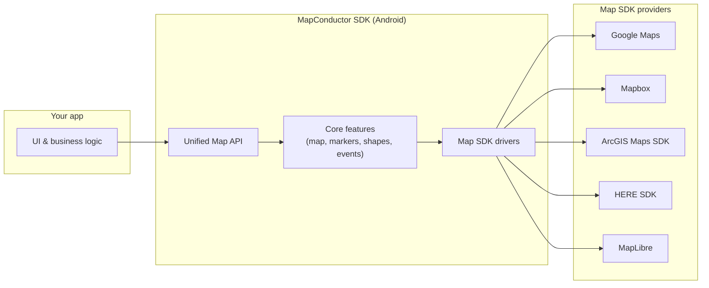
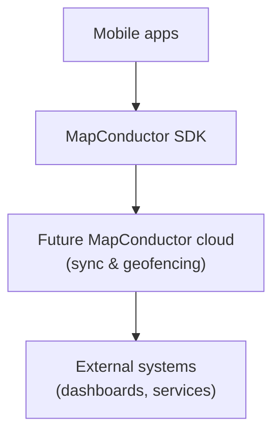

At a high level, MapConductor sits between your app and the underlying map SDKs. Your app talks to MapConductor using a unified set of classes and methods. MapConductor then forwards those operations to the selected map provider.

For example, you can add a marker or draw a polygon through MapConductor, and MapConductor will translate that into the correct calls for Google Maps, Mapbox, ArcGIS, HERE, or MapLibre on Android.

## Core architecture

From the developer’s point of view:

- You write your map code against the **Unified Map API**.
- The **Core** layer handles common behavior such as shapes, events, and state.
- The **Drivers** translate those common operations into each underlying provider’s SDK calls.

## Scope of abstraction

MapConductor does not try to wrap every single capability of each map SDK. Instead, it focuses on common operations such as showing a map, markers, and basic shapes, while still giving developers access to the underlying native map instances when they need provider‑specific features. This keeps the shared API simple and portable without sacrificing what makes each provider unique.

## Future cloud vision (abstract)

In the long term, we also envision optional cloud components that can help with data synchronization, geofencing, and integration with external systems. These cloud‑side pieces are still in the design phase and not part of the current public SDK.

For now, the main focus of the project is the Android SDK and its unified API. Detailed cloud architecture and implementation choices will be documented separately when they are ready to share.
