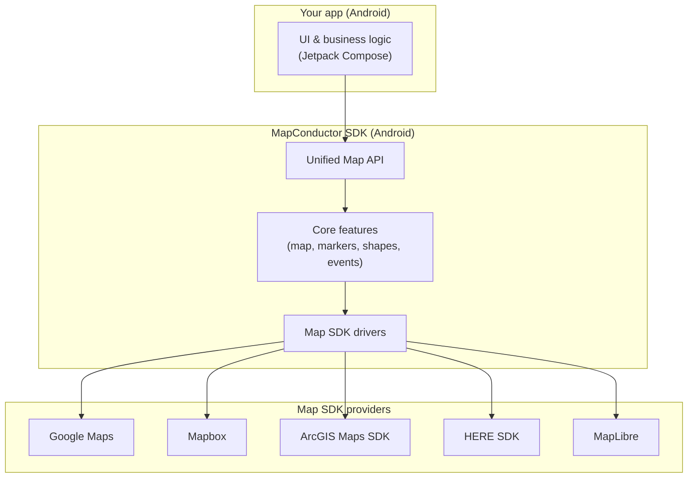
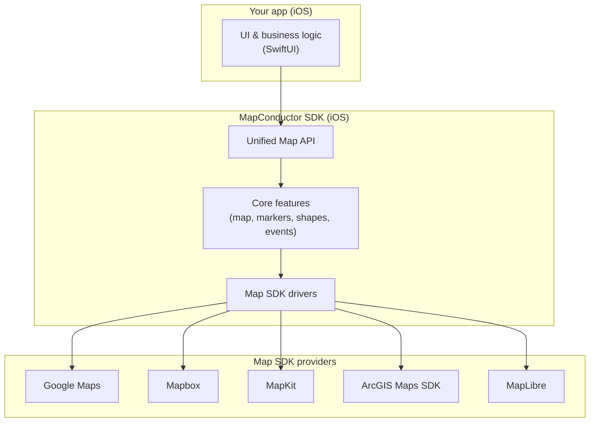

At a high level, MapConductor sits between your app and the underlying map SDKs. Your app talks to MapConductor using a unified set of classes and methods. MapConductor then forwards those operations to the selected map provider.

MapConductor is available for both Android (Kotlin + Jetpack Compose) and iOS (Swift + SwiftUI), each with its own SDK package built on a shared design.

## Android architecture

## iOS architecture

From the developer’s point of view:

- You write your map code against the **Unified Map API**.
- The **Core** layer handles common behavior such as shapes, events, and state.
- The **Drivers** translate those common operations into each underlying provider’s SDK calls.

## Scope of abstraction

MapConductor does not try to wrap every single capability of each map SDK. Instead, it focuses on common operations such as showing a map, markers, and basic shapes, while still giving developers access to the underlying native map instances when they need provider‑specific features. This keeps the shared API simple and portable without sacrificing what makes each provider unique.
