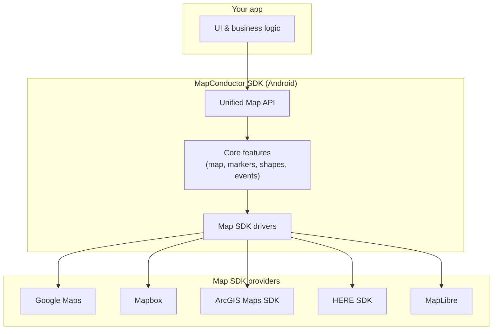
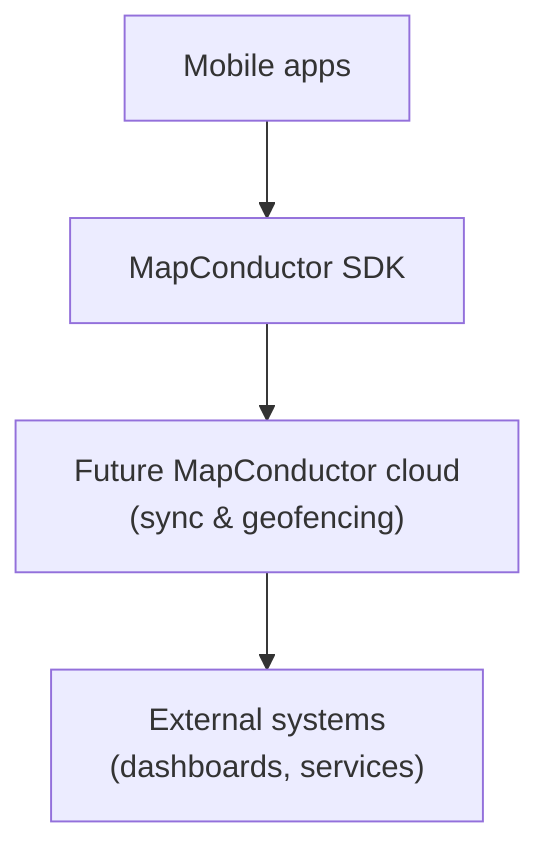

A grandes rasgos, MapConductor se sitúa entre tu aplicación y los SDK de mapas subyacentes. Tu app habla con MapConductor usando un conjunto unificado de clases y métodos, y MapConductor reenvía esas operaciones al proveedor de mapas seleccionado.

Por ejemplo, puedes añadir un marcador o dibujar un polígono a través de MapConductor, y MapConductor lo traducirá a las llamadas adecuadas de Google Maps, Mapbox, ArcGIS, HERE o MapLibre en Android.

## Arquitectura principal

Desde el punto de vista de la persona desarrolladora:

- Escribes tu código de mapas contra la **Unified Map API**.
- La capa **Core** se encarga del comportamiento común, como figuras, eventos y estado.
- Los **Drivers** traducen esas operaciones comunes a las llamadas concretas de cada SDK de proveedor.

## Alcance de la abstracción

MapConductor no intenta envolver todas las capacidades de cada SDK de mapas. Se enfoca en operaciones comunes como mostrar el mapa, marcadores y figuras básicas, pero sigue permitiendo el acceso a las instancias nativas del mapa cuando se necesitan funciones específicas de un proveedor. De este modo, la API compartida se mantiene simple y portable sin sacrificar lo que hace único a cada proveedor.

## Visión futura en la nube (resumen)

A largo plazo, también imaginamos componentes opcionales en la nube que ayuden con la sincronización de datos, geocercas e integración con sistemas externos. Estos componentes del lado del servidor siguen en fase de diseño y todavía no forman parte del SDK público actual.

Por ahora, el foco principal del proyecto es el SDK de Android y su API unificada. La arquitectura detallada en la nube y las decisiones de implementación se documentarán por separado cuando estén listas para compartirse.

