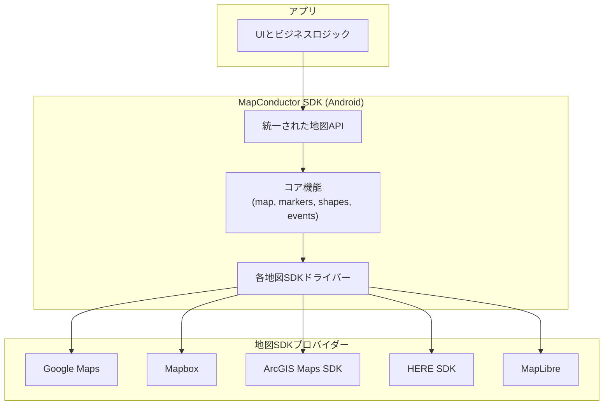
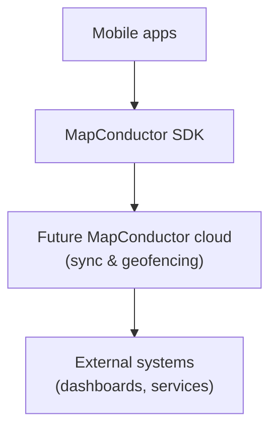

MapConductor はアプリケーションと各種地図 SDK の橋渡しを行います。アプリは統一されたクラスとメソッド群を通じて MapConductor にアクセスし、MapConductor が選択された地図プロバイダへ処理を転送します。

例えば、MapConductor 経由でマーカーを追加したりポリゴンを描画すると、内部では Android 向けの Google Maps、Mapbox、ArcGIS、HERE、MapLibre のそれぞれに適切な呼び出しが行われます。

## コアアーキテクチャ

開発者の視点からは、次のように理解できます。

- 地図関連のコードは、すべて **統一された地図 API（Unified Map API）** に対して記述します。
- **Core** レイヤーが、図形やイベント、状態管理などの共通処理を担当します。
- **Drivers** が、それらの共通操作を各プロバイダの SDK 呼び出しに変換します。

## 抽象化の範囲

MapConductor は、各地図 SDK が提供するすべての機能をラップしようとはしません。地図表示やマーカー、基本的な図形描画など、共通してよく使われる操作にフォーカスしつつ、必要な場合にはネイティブの地図インスタンスに直接アクセスできるようにしています。これにより、共通 API はシンプルで移植性が高いまま、各プロバイダ固有の強みも損なわない設計になっています。

## 将来のクラウド構想（概要）

長期的には、データ同期やジオフェンシング、外部システム連携を支援するオプションのクラウドコンポーネントも構想しています。これらクラウド側の仕組みはまだ設計段階であり、現時点の公開 SDK には含まれていません。

当面の重点は、Android SDK とその統一 API にあります。クラウドアーキテクチャの詳細や実装選択については、公開の準備が整い次第、別途ドキュメントとしてまとめる予定です。

