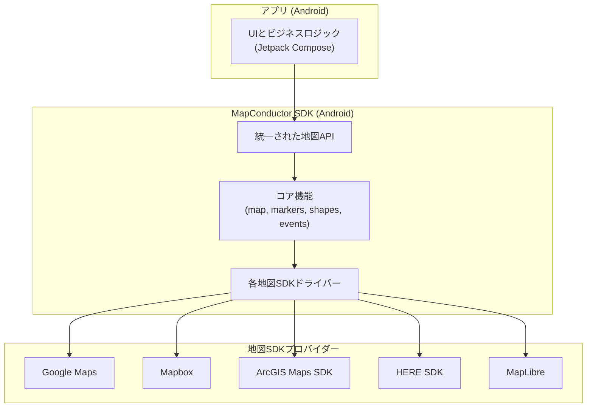
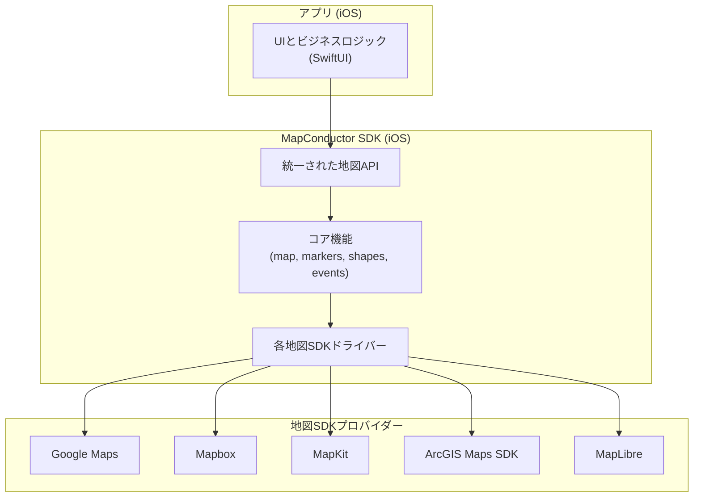

MapConductor はアプリケーションと各種地図 SDK の橋渡しを行います。アプリは統一されたクラスとメソッド群を通じて MapConductor にアクセスし、MapConductor が選択された地図プロバイダへ処理を転送します。

MapConductor は Android（Kotlin + Jetpack Compose）と iOS（Swift + SwiftUI）の両方に対応しており、それぞれプラットフォーム向けの SDK パッケージが共通の設計思想に基づいて提供されています。

## Android アーキテクチャ

```mermaid
flowchart TB
  subgraph App["アプリ (Android)"]
    UI["UIとビジネスロジック<br/>(Jetpack Compose)"]
  end

  subgraph MC["MapConductor SDK (Android)"]
    API["統一された地図API"]
    Core["コア機能<br/>(map, markers, shapes, events)"]
    Drivers["各地図SDKドライバー"]
  end

  subgraph Providers["地図SDKプロバイダー"]
    GMaps["Google Maps"]
    Mapbox["Mapbox"]
    ArcGIS["ArcGIS Maps SDK"]
    HERE["HERE SDK"]
    MapLibre["MapLibre"]
  end

  UI --> API
  API --> Core
  Core --> Drivers
  Drivers --> GMaps
  Drivers --> Mapbox
  Drivers --> ArcGIS
  Drivers --> HERE
  Drivers --> MapLibre
```

## iOS アーキテクチャ

```mermaid
flowchart TB
  subgraph App["アプリ (iOS)"]
    UI["UIとビジネスロジック<br/>(SwiftUI)"]
  end

  subgraph MC["MapConductor SDK (iOS)"]
    API["統一された地図API"]
    Core["コア機能<br/>(map, markers, shapes, events)"]
    Drivers["各地図SDKドライバー"]
  end

  subgraph Providers["地図SDKプロバイダー"]
    GMaps["Google Maps"]
    Mapbox["Mapbox"]
    MapKit["MapKit"]
    ArcGIS["ArcGIS Maps SDK"]
    MapLibre["MapLibre"]
  end

  UI --> API
  API --> Core
  Core --> Drivers
  Drivers --> GMaps
  Drivers --> Mapbox
  Drivers --> MapKit
  Drivers --> ArcGIS
  Drivers --> MapLibre
```

開発者の視点からは、次のように理解できます。

- 地図関連のコードは、すべて **統一された地図 API（Unified Map API）** に対して記述します。
- **Core** レイヤーが、図形やイベント、状態管理などの共通処理を担当します。
- **Drivers** が、それらの共通操作を各プロバイダの SDK 呼び出しに変換します。

## 抽象化の範囲

MapConductor は、各地図 SDK が提供するすべての機能をラップしようとはしません。地図表示やマーカー、基本的な図形描画など、共通してよく使われる操作にフォーカスしつつ、必要な場合にはネイティブの地図インスタンスに直接アクセスできるようにしています。これにより、共通 API はシンプルで移植性が高いまま、各プロバイダ固有の強みも損なわない設計になっています。
